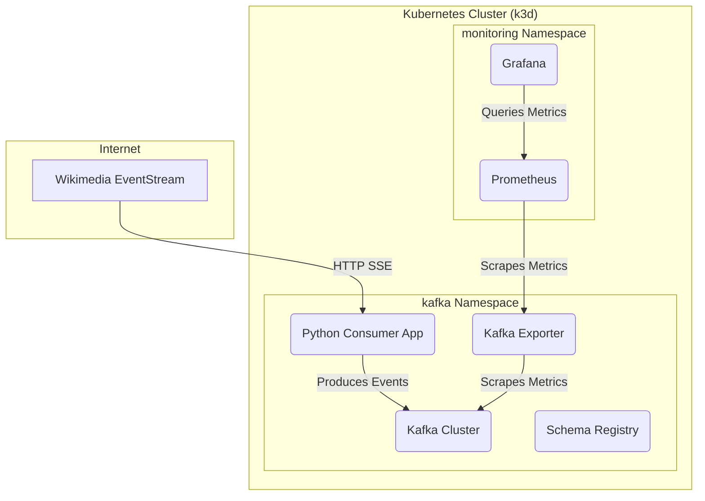

<div id="top">

<div align="center">


# Real-Time Wikimedia Data Streaming POC

<em>A fully automated, observable, real-time data streaming platform built on a local Kubernetes cluster.</em>

<em>Built with these tools and technologies:</em>


</div>
<br>

---

## Table of Contents

- [Overview](#overview)
- [Features](#features)
- [Architecture](#architecture)
- [Project Structure](#project-structure)
- [Getting Started](#getting-started)
  - [Prerequisites](#prerequisites)
  - [Installation & Usage](#installation--usage)
- [Workflow Commands](#workflow-commands)
- [Contributing](#contributing)
- [License](#license)

---

## Overview

This project is a comprehensive Proof-of-Concept (POC) for building an end-to-end, real-time data streaming and observability platform. It demonstrates modern DevOps and Data Engineering practices using Infrastructure as Code (IaC) and automation.

The pipeline ingests a live stream of `page-move` events from Wikimedia, publishes them into a Kafka cluster running on Kubernetes, and provides a Grafana dashboard to visualize the incoming data rate and total message count in real-time. The entire stack, from the local Kubernetes cluster to the application and dashboards, is managed by a simple, automated command-line interface using `just`.

---

## Features

- **Automated Infrastructure:** The entire Kubernetes cluster (K3d) is provisioned and managed as code using Terraform and Terragrunt.
- **Real-Time Ingestion:** A resilient Python application connects to the live Wikimedia EventStream and publishes data to Kafka.
- **Managed Data Bus:** A robust, ZooKeeper-based Kafka cluster and Schema Registry are deployed on Kubernetes, managed by the Strimzi operator and Helm.
- **Full Observability:** The stack includes a complete monitoring suite with Prometheus for metrics collection, a Kafka Exporter, and Grafana for visualization.
- **Declarative Dashboards:** The Grafana dashboard is also defined as code in a Kubernetes `ConfigMap` and deployed automatically.
- **One-Command Workflow:** A `Justfile` provides a simple, powerful interface (`just all`, `just clean`, `just connect`, etc.) to manage the entire lifecycle of the platform.

---

## Architecture


---

## Project Structure

```sh
.
├── app/
│   ├── consumer.py
│   ├── Dockerfile
│   ├── deployment.yaml
│   └── requirements.txt
├── environment/
│   └── dev/
│       └── terragrunt.hcl
├── helm/
│   ├── grafana-kafka-dashboard.yaml
│   ├── kafka-cluster.yaml
│   ├── kafka-exporter-deployment.yaml
│   └── prometheus-values.yaml
├── justfile
├── modules/
│   └── k3d-cluster/
│       └── ...
└── root.hcl
```
---

## Getting Started

### Prerequisites

This stack requires a machine with **at least 16GB of RAM**. Before you begin, ensure you have the following tools installed in your development environment (e.g., Ubuntu, CentOS).

- **Docker:** To run the containers. [Installation Guide](https://docs.docker.com/engine/install/ubuntu/).
- **k3d:** To run a local Kubernetes cluster.
    ```bash
    curl -s https://raw.githubusercontent.com/k3d-io/k3d/main/install.sh | bash
    ```
- **kubectl:** To interact with the Kubernetes cluster.
    ```bash
    # Note: Use a version that matches your k3d server version for best results.
    curl -LO https://dl.k8s.io/release/v1.31.5/bin/linux/amd64/kubectl
    chmod +x ./kubectl
    sudo mv ./kubectl /usr/local/bin/kubectl
    ```
- **Helm:** The package manager for Kubernetes.
    ```bash
    curl https://raw.githubusercontent.com/helm/helm/main/scripts/get-helm-3 | bash
    ```
- **Terraform & Terragrunt:** To manage infrastructure as code.
    ```bash
    # Install tfenv (for Terraform) & tgenv (for Terragrunt)
    git clone https://github.com/tfutils/tfenv.git ~/.tfenv
    echo 'export PATH="$HOME/.tfenv/bin:$PATH"' >> ~/.bashrc
    git clone https://github.com/cunymatthieu/tgenv.git ~/.tgenv
    echo 'export PATH="$HOME/.tgenv/bin:$PATH"' >> ~/.bashrc
    source ~/.bashrc

    # Install the latest versions
    tfenv install latest && tfenv use latest
    tgenv install latest && tgenv use latest
    ```
- **just:** A handy command runner to automate our workflows.
    ```bash
    sudo apt update && sudo apt install just
    ```
---
### Installation & Usage

The entire workflow is managed by the `justfile`.

1. **Clone the repository:**
    ```sh
    git clone https://github.com/rdrishabh38/wikimedia-analytics.git
    cd wikimedia-poc
    ```

2. **Start the Entire Stack:**
    This single command builds everything: the Kubernetes cluster, all infrastructure services (Kafka, Monitoring), and the Python application.
    ```sh
    just all
    ```
    > **Disclaimer:** This command starts many services at once. On machines with 16GB or less of RAM, this may cause resource contention. If you experience issues, use the more stable Step-by-Step method below.

3. **Step-by-Step Startup (Recommended):**
    Please refer to section *Step-by-Step Manual Startup Guide* for a step by step startup

---

## Workflow Commands

Use the `just` command from the project root to manage your environment. Run `just` or `just help` to see all available commands.

- `just all`: Build and deploy the entire stack (infra + app).
- `just clean`: Destroy the entire stack completely.
- `just infra-up`: Deploy only the infrastructure (K8s, Kafka, Monitoring).
- `just app-deploy`: Deploy only the Python application.
- `just status`: Check the status of all pods.
- `just connect`: Start port-forwarding to Grafana & Prometheus and print login details.
- `just disconnect`: Stop all background port-forwarding.
- `just pause`: Quickly stop the K3d cluster to save resources.
- `just resume`: Quickly resume the paused cluster.
- `just app-logs`: View the live logs from the consumer application.

---

# Step-by-Step Manual Startup Guide

This guide provides the commands to bring up each component of the data platform one by one. Each step includes a verification command to ensure the component is healthy before proceeding to the next.

This method is recommended for debugging or for users on resource-constrained systems.

---
### **Step 1: Start the Kubernetes Cluster**
This command uses Terragrunt to provision the 3-node K3d cluster.

**Command:**
```bash
just cluster
```
**Verification:**
Wait for the command to complete, then run the following. You must see all three nodes with a `STATUS` of `Ready`.
```bash
kubectl get nodes -A
```
---
### **Step 2: Install Strimzi Custom Resource Definitions (CRDs)**
This command teaches our Kubernetes cluster about Strimzi resource types like `Kafka`.

**Command:**
```bash
just crds
```
**Verification:**
Run the following command. You should see a list of resources ending in `strimzi.io`.
```bash
kubectl get crds | grep strimzi.io
```
---
### **Step 3: Add Helm Repositories**
This command adds the `bitnami` and `prometheus-community` chart repositories to Helm.

**Command:**
```bash
just helm-repos
```
**Verification:**
Run the following command. You should see all three repositories listed.
```bash
helm repo list
```
---
### **Step 4: Deploy the Strimzi Operator**
This command uses Helm to install the Strimzi operator, which will manage our Kafka cluster.

**Command:**
```bash
just operator
```
**Verification:**
Watch the pods in the `kafka` namespace. Wait until the `strimzi-cluster-operator-...` pod is `1/1 Running`.
```bash
kubectl get pods -n kafka -w
```
*(Press `Ctrl+C` to stop watching once it's ready.)*

---
### **Step 5: Deploy the Kafka Cluster**
This command applies our `Kafka` custom resource. The operator will see this and build the cluster.

**Command:**
```bash
just kafka
```
**Verification:**
Watch the pods again. Wait until `my-cluster-zookeeper-0`, `my-cluster-kafka-0`, and `my-cluster-entity-operator-...` are all `Running`. This can take a few minutes.
```bash
kubectl get pods -n kafka -w
```
---
### **Step 6: Deploy the Schema Registry**
This command installs the Schema Registry, which connects to our Kafka cluster.

**Command:**
```bash
just schema-registry
```
**Verification:**
Watch the pods. Wait until `schema-registry-0` and `schema-registry-kafka-controller-0` are `Running`.
```bash
kubectl get pods -n kafka -w
```
---
### **Step 7: Deploy the Monitoring Stack (Prometheus & Grafana)**
This command installs the core monitoring services into their own `monitoring` namespace.

**Command:**
```bash
just monitoring-up
```
**Verification:**
Watch the pods in the `monitoring` namespace. Wait until all pods (Prometheus, Grafana, Alertmanager, etc.) are `Running`. This can take several minutes.
```bash
kubectl get pods -n monitoring -w
```
---
### **Step 8: Deploy the Kafka Exporter**
This command deploys a pre-created dashboard `Kafka Incoming Data Metrics` to Grafana instance.

**Command:**
```bash
just monitoring-dashboards
```
**Verification:**
Watch the `kafka` namespace. Wait until the `kafka-exporter-...` pod is `1/1 Running`.
```bash
kubectl get pods -n kafka -w
```
---

**Verification:**
At this point, you can use `just connect` to access the Grafana UI and verify that the "Wikimedia Incoming Metrics" dashboard is present.

---
### **Step 10: Deploy the Consumer Application**
Finally, this command builds and deploys our Python application.

**Command:**
```bash
just app-deploy
```
**Verification:**
Watch the `kafka` namespace. Wait until the `wikimedia-consumer-...` pod is `1/1 Running`.
```bash
kubectl get pods -n kafka -w
```
Once it's running, you can view the live logs with `just app-logs`.

## Contributing

Contributions are welcome! Please feel free to submit a pull request for any improvements or bug fixes. For major changes, please open an issue first to discuss what you would like to change.

1.  Fork the Project.
2.  Create your Feature Branch (`git checkout -b feature/AmazingFeature`).
3.  Commit your Changes (`git commit -m 'Add some AmazingFeature'`).
4.  Push to the Branch (`git push origin feature/AmazingFeature`).
5.  Open a Pull Request.

---

## License

This project is distributed under the **GNU General Public License v3.0**.
See [LICENSE](https://www.gnu.org/licenses/gpl-3.0.en.html) for more information.

---
<div align="right">

[![][back-to-top]](#top)

</div>


[back-to-top]: https://img.shields.io/badge/-BACK_TO_TOP-151515?style=flat-square
